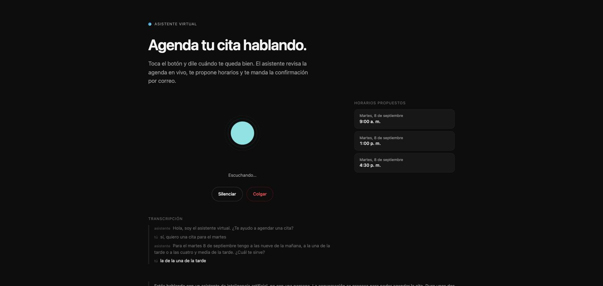
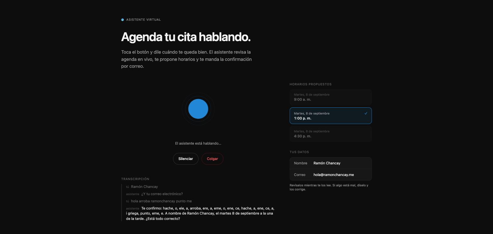
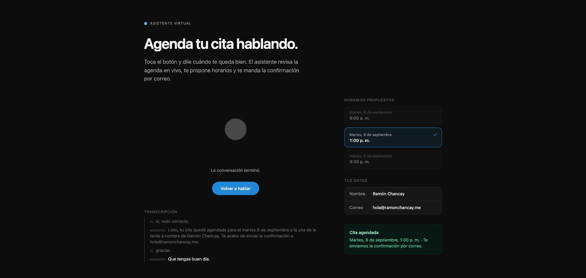

# Voice agent for booking appointments

A visitor opens a page, talks to an assistant in Spanish, and hangs up with a
confirmed 30-minute appointment on the business calendar. ElevenLabs handles
voice and turn-taking, Cal.com handles the calendar, and in between sits a
backend whose entire job is to make sure the language model never has to guess.

```
Browser (ElevenLabs widget)
        │ WebRTC
        ▼
ElevenLabs Agents            STT · turn-taking · LLM · TTS
        │ webhook tools (HTTPS + bearer)
        ▼
Backend (Fastify + TypeScript)
        │
        ▼
Cal.com API v2
        │
        ▼
Google Calendar
```

The backend is the only component that talks to Cal.com. ElevenLabs never sees
the API key and never builds a booking payload.

---

## Demo

The page shows the **booking** as it happens, not a chat log. The times below
are real openings returned by Cal.com for this account.

**1 · The agent offers times.** It called `check_availability`, read the summary
the tool had already written, and is waiting for a choice. The orb tracks the
microphone; the transcript is a subtitle track, not a conversation to scroll.



**2 · You read your details while they are spelled to you.** Before asking for
confirmation the agent calls `show_booking_summary`, a client tool that draws
straight into the page. A misheard email is hard to catch by ear and easy to
catch by eye — this is the step that catches it.



**3 · Confirmed.** `book_appointment` ran only after an explicit "sí", and the
panel reports the appointment from the booking result — not from what the agent
said it did.



---

## The agent

The agent is **defined by versioned JSON in `agent/`** and applied with the
ElevenLabs CLI. Nothing is configured by clicking in the dashboard, because
anything changed there is overwritten by the next push.

```
agent/
  agents.json                        CLI registry
  tools.json                         CLI registry
  agent_configs/
    appointment_scheduler.json       prompt, ASR, TTS, turn-taking, evaluation
  tool_configs/
    check_availability.json          webhook tool → POST /tools/availability
    book_appointment.json            webhook tool → POST /tools/book
    show_booking_summary.json        client tool  → runs in the browser
```

**What it does.** Greets, pins down a concrete date, calls
`check_availability`, reads back the options the tool already phrased for
speech, takes a choice, collects name and email one at a time, spells the email
back character by character, waits for an explicit *"sí"* — and only then calls
`book_appointment`.

**The four design decisions that make it work:**

*The model never does date arithmetic.* The current date and time in the
business timezone are injected as a dynamic variable at the start of every
conversation, fetched from the backend so the visitor's own clock is irrelevant.
The prompt declares that variable the single source of truth about today.

*The model never writes a time.* `check_availability` returns at most three
options with a `spokenLabel` already written out — *"el martes 8 de septiembre a
las diez de la mañana"* — plus a `spokenSummary` the agent reads verbatim.
Booking passes `optionId` (`opt_1`), never a timestamp. That removes the entire
timezone-bug surface from the LLM side.

*Booking is guarded twice.* The prompt requires an explicit read-back and
confirmation before the only irreversible action in the conversation, and the
tool sets `interruption_mode: disable_during_tool` so a caller cannot interrupt
mid-write and leave the agent unsure whether the appointment exists. A
`bookingKey` tied to the conversation id makes a repeated call idempotent.

*You read your email while it is spelled to you.* Names and addresses dictated
by voice are transcribed wrong often, and checking one by ear is hard. Before
asking for confirmation the agent calls `show_booking_summary`, a client tool
that draws the details straight into the page — no backend round trip, so the
personal data never leaves the browser it was dictated into.

*Failures stay speakable.* Tool errors return HTTP `200` with `booked: false`, a
machine-readable `reason`, and a sentence the agent can read out loud. A `5xx`
would leave the model improvising in the middle of a live call.

Every conversation is scored automatically against three criteria: an
appointment was actually created, confirmation preceded booking, and no time was
mentioned that did not come from the tool.

Full documentation — prompt structure, ASR/TTS/turn settings and the reasoning
behind each, tool contracts, evaluation criteria and the simulation
harness — is in **[`docs/agent.md`](./docs/agent.md)**.

---

## The interface

The page uses the ElevenLabs **SDK**, not the embedded widget. The widget is a
closed component with its own chat bubble, feedback panel and floating button;
the SDK is transport only — WebRTC, microphone, callbacks — so the interface is
entirely ours, and Vite has something to do.

What that buys is a page that shows the **booking** rather than a chat log: an
orb that tracks the microphone while the agent listens and the agent's own
output while it speaks, an explicit state line, a discreet subtitle track, and a
panel that fills in as the conversation advances — the three times just offered,
the one that was picked, the name and email as understood, the confirmation.

The times come from `GET /agent/session/:id`, polled every two seconds, because
they are what Cal.com actually returned; reading them off the transcript would
mean rendering what the model *said*. The key needed no invention: the page
reads `conversation.getId()`, which is already the `bookingKey` the backend
files every offered option under.

The SDK is a ~600 kB WebRTC bundle, so it is loaded on demand and warmed up when
the page goes idle. First paint costs 10 kB of JavaScript.

---

## Why there is a backend and not a proxy

Because every responsibility moved out of the model is an entire class of bug
that disappears:

- **Dates.** All timezone arithmetic lives in one file, `src/lib/time.ts`,
  covered by tests with a frozen clock.
- **Pre-chewed options.** Cal.com returns dozens of raw slots; the backend picks
  three spread across the day and phrases them for speech.
- **Fallbacks.** If the requested part of day is full, the rest of the day is
  offered. If the whole day is full, the next 7 are searched **in parallel** —
  sequentially that would be up to 7 chained round-trips, and that silence is
  audible.
- **Idempotency.** One `bookingKey` per conversation.
- **Validation.** Zod rejects malformed LLM payloads before they reach Cal.com.
- **Traceability.** One structured log line per call, which is what makes a
  conversation that went wrong debuggable afterwards.

---

## Running it locally

A pnpm monorepo: backend at the root, landing page in `web/`.

```bash
pnpm install            # both packages
cp .env.example .env    # then fill it in
pnpm dev                # backend on :3000
curl localhost:3000/health
```

The landing page, in another terminal:

```bash
cp web/.env.example web/.env   # then fill it in
pnpm web:dev                   # Vite on :5173
```

If a variable is missing the process dies at boot naming it. It does not fail
later, in the middle of a call.

```bash
pnpm test          # 153 tests, none of them touch the network
pnpm typecheck
pnpm lint
pnpm build         # backend to dist/
pnpm web:build     # landing to web/dist/
```

### With Docker

To bring both pieces up exactly as they run in production, using the same image
Railway builds:

```bash
cp .env.example .env       # then fill it in
pnpm compose:up            # docker compose up --build
```

```
backend   http://localhost:3000/health
landing   http://localhost:8080
```

`pnpm compose:down` stops it, `pnpm compose:logs` follows the logs.

This does **not** give you hot reload — for development `pnpm dev` and
`pnpm web:dev` are better. Compose is for checking that what is about to be
deployed actually starts.

Two things worth knowing: Vite inlines `VITE_*` variables at build time, so
changing one requires a rebuild; and `VITE_BACKEND_URL` is the address **the
browser** resolves, not the compose network, so locally it is
`http://localhost:3000` and never `http://api:3000`.

The conversation log lives on a volume, so it survives a container restart.

### Against the live Cal.com API

```bash
pnpm smoke:slots                # reads availability; books nothing
pnpm smoke:book -- --yes        # creates ONE real booking
```

### Against the live agent, without spending voice minutes

```bash
pnpm simulate                   # six scripted conversations, with assertions
```

The free plan gives 15 voice minutes a month and they cannot be topped up, so
all prompt iteration happens in text. The harness asserts that booking always
followed an explicit confirmation, that no invented times were offered, and that
confirming twice does not create two appointments.

---

## HTTP API

| Method | Path | Auth | Purpose |
|---|---|---|---|
| `GET` | `/health` | — | Railway health check |
| `GET` | `/agent/context` | — | Current date and time in the business timezone |
| `GET` | `/agent/session/:bookingKey` | — | Live booking state, for the landing page |
| `POST` | `/tools/availability` | Bearer | Webhook tool: look up open times |
| `POST` | `/tools/book` | Bearer | Webhook tool: create the booking |
| `POST` | `/webhooks/post-call` | HMAC signature | Conversation log |
| `GET` | `/webhooks/stats` | Bearer | *"12 conversations, 8 appointments"* |

Request and response shapes, error semantics and auth details are in
**[`docs/api.md`](./docs/api.md)**.

---

## Security

- Both tools require `Authorization` carrying `TOOLS_SHARED_SECRET`. Both
  `Bearer <token>` and the bare token are accepted, because the ElevenLabs
  Secrets Manager substitutes the entire header value with no documented way to
  prepend a prefix.
- The post-call webhook is verified by HMAC-SHA256 over the **raw** body, with a
  30-minute replay window. No valid signature: `401`.
- Constant-time comparisons; `authorization` and the signature are redacted from
  the logs.
- Per-IP rate limiting, with `/health` exempt so Railway's probe does not eat the
  quota.
- `/agent/session/:bookingKey` is public — the alternative would be shipping the
  shared tool secret inside a static page — and carries no personal data on any
  path, which a test asserts directly.
- No Cal.com key ever leaves the backend.

---

## Timezone

Business timezone: `America/Guayaquil`, GMT-5 with no daylight saving.

All conversion lives in `src/lib/time.ts`; no other file does date arithmetic.
Offsets are computed with `Intl` rather than hardcoded, so moving the business to
a DST timezone does not break anything.

Two behaviours that came from reading the Cal.com API rather than assuming it:

- `GET /v2/slots` interprets `start` and `end` as **UTC** but groups the response
  keys by the `timeZone` you request.
- Each endpoint requires a different `cal-api-version`: `2024-09-04` for slots,
  `2026-02-25` for bookings. Sending the wrong one does not produce a clear
  error.

---

## Stack

Node 22 · TypeScript · Fastify · Zod · Vitest · pnpm workspaces · Docker
(multi-stage, alpine, non-root) · Railway · Vite + Tailwind v4 for the landing ·
Cal.com API v2 · ElevenLabs Agents.

Fastify rather than NestJS: less boilerplate for an MVP this size.

---

## Language policy

**Code is English**: identifiers, comments, test names, logs, internal errors,
and all documentation.

**Spanish is reserved for what reaches a person**: the sentences the agent reads
out loud (`spokenLabel`, `spokenSummary`, `spokenConfirmation`), the system
prompt, and the visible copy of the landing page.

The reasoning is practical: those Spanish strings are product data, not code. If
only a developer ever sees a string, it is written in English.

---

## Documentation

| Document | What is in it |
|---|---|
| [`docs/agent.md`](./docs/agent.md) | The agent: prompt, runtime settings, tools, evaluation, simulation |
| [`docs/architecture.md`](./docs/architecture.md) | System design, failure policy, timezone, security, layout |
| [`docs/api.md`](./docs/api.md) | HTTP endpoint reference |
| [`docs/deployment.md`](./docs/deployment.md) | Railway, ElevenLabs CLI, webhook, landing page, secret rotation |
| [`docs/build-plan.md`](./docs/build-plan.md) | The phased build plan and what was verified in each phase |
